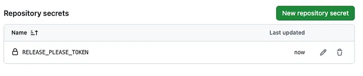
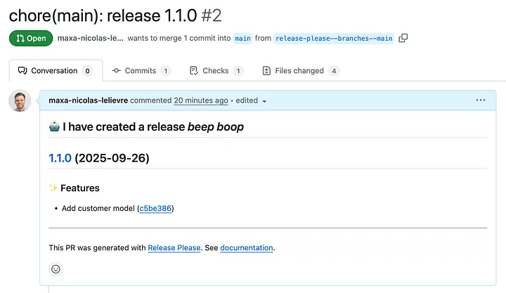
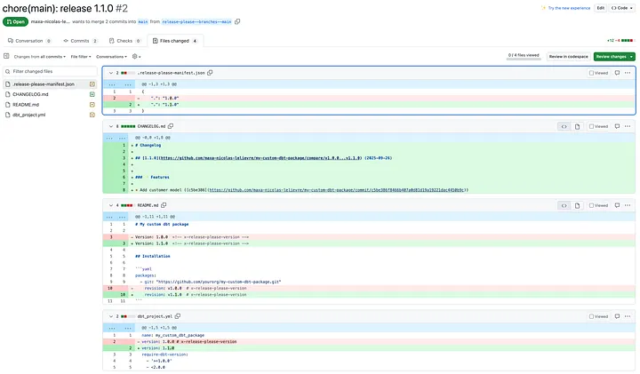
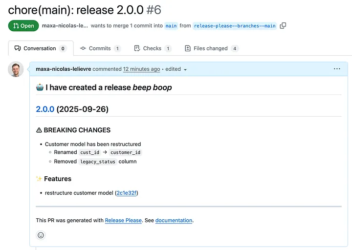
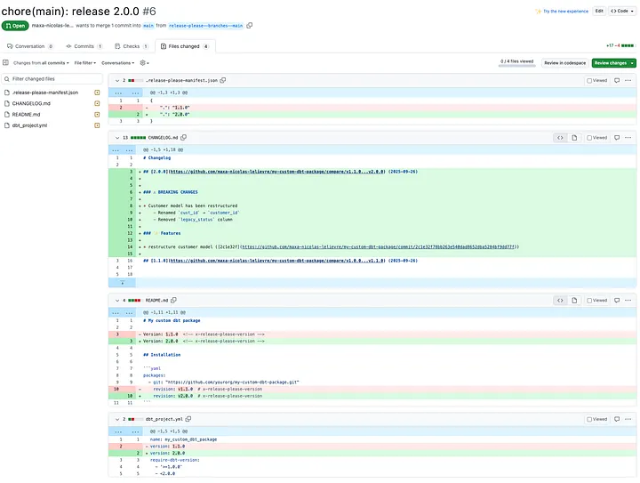
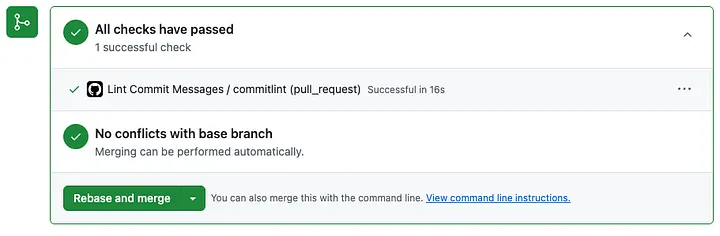
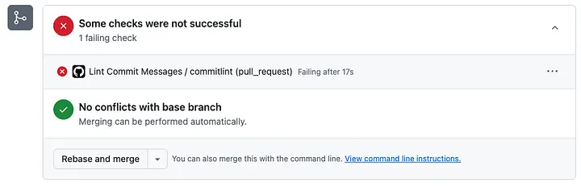

You've done the hard work: you've extracted reusable parts of your dbt project: utility macros, staging models, or shared transformation logic into a custom dbt package. Multiple projects now depend on it.

This is exciting, but also risky. Every change to your package has the potential to break all those downstream projects. A "quick fix" to a macro might suddenly crash 10 production pipelines.

## The Problem with Manual Versioning

Without proper versioning, you're flying blind:

- **No clear version history**: Which version is in production? Which has the bug fix?
- **Forgotten changelogs**: What changed between versions? Nobody remembers.
- **Breaking changes slip through**: A small macro change can break dependent projects silently.
- **Manual tagging is error-prone**: Forgetting to tag a release or tagging the wrong commit causes confusion.

## The Solution: release-please

There's a better way: automation with **release-please**. It's a GitHub Action from Google that takes the pain out of versioning. Every time you merge to main, release-please handles versioning automatically: no manual tagging, no forgotten changelogs, no broken downstream projects.

## How It Works

1. You write commits following **Conventional Commits** (e.g., `feat: add new macro`, `fix: handle null values`)
2. release-please analyzes your commits and creates a "Release PR"
3. The Release PR updates the version and changelog based on your commits
4. When you merge the Release PR, release-please creates a GitHub release with the new tag

## Setting Up release-please

### Project Structure

Here's the recommended structure for your dbt package:

```
my-dbt-package/
├── dbt_project.yml
├── README.md
├── macros/
├── models/
├── .github/
│   └── workflows/
│       ├── release-please.yml
│       └── commitlint.yml
├── release-please-config.json
├── .release-please-manifest.json
└── .commitlintrc.yml
```

### Step 1: Create the Configuration Files

Create two files in the root of your repository:

**release-please-config.json** (basic):

```json
# release-please-config.json
{
    "release-type": "simple",
    "packages": {
      ".": {
        "extra-files": [
          "dbt_project.yml",
          "README.md"
        ]
      }
    }
}
```

**release-please-config.json** (advanced with changelog sections):

```json
# release-please-config.json
{
    "release-type": "simple",
    "packages": {
      ".": {
        "extra-files": [
          "dbt_project.yml",
          "README.md"
        ]
      }
    },
    "changelog-sections": [
        { "type": "feat", "section": "✨ Features" },
        { "type": "fix", "section": "🐛 Bug Fixes" },
        { "type": "perf", "section": "⚡ Performance Improvements" },
        { "type": "refactor", "section": "🔧 Refactoring", "hidden": false },
        { "type": "docs", "section": "📚 Documentation", "hidden": false },
        { "type": "test", "section": "🧪 Tests", "hidden": true },
        { "type": "style", "section": "🎨 Code Style", "hidden": true },
        { "type": "chore", "section": "🧹 Chores & Maintenance", "hidden": true },
        { "type": "build", "section": "🏗️ Build System", "hidden": true },
        { "type": "ci", "section": "🔄 CI/CD", "hidden": true },
        { "type": "revert", "section": "⏪ Reverts", "hidden": false }
    ]
}
```

Key configuration options explained:

- **"release-type": "simple"**: Uses a straightforward versioning strategy suitable for most dbt packages
- **"extra-files"**: Lists additional files where release-please should update version numbers
- **"changelog-sections"**: Customizes which commit types appear in your changelog
- **"hidden": false**: Includes commit types that are normally excluded from changelogs (like documentation updates)

The other file to add is **release-please-manifest.json**. It tracks the current version of your package. Release-please uses this to determine what the next version should be.

```json
// release-please-manifest.json
{
    ".": "1.0.0"
}
```

The "." refers to the root package, and "1.0.0" is your starting version. If you're setting up release-please for an existing package, set this to your current version.

### Step 2: Mark Version Locations

Release-please needs to know where to update version numbers in your files. You do this by adding special comments.

In your dbt_project.yml, add a version marker comment:

```yaml
# dbt_project.yml
name: 'my_custom_package'
version: '1.0.0'  # x-release-please-version
require-dbt-version:
  - '>=1.0.0'
  - <2.0.0
```

In your README.md (optional but recommended):

```md
<!--- README.md -->
# My custom dbt package

Version: 1.0.0  <!-- x-release-please-version -->

## Installation

```yaml
packages:
  - git: "https://github.com/yourorg/my-custom-dbt-package.git"
    revision: v1.0.0  # x-release-please-version
```

### Step 3: Create Personal Access Token

1. Go to GitHub → Settings → Developer settings → Personal access tokens
2. Click Generate new token (classic)
3. Give it a descriptive name (e.g., release-please-token).
4. Set the expiration (depending on your security policy)
5. Select scopes: repo → full access to repositories + workflow
6. Save and copy the token
7. In your repository, go to Settings → Secrets and variables → Actions.
8. Click New repository secret.
9. Name it: RELEASE_PLEASE_TOKEN.
10. Paste the token value.
11. Save.



### Step 4: Create Github Workflow

Create the file **.github/workflows/release-please.yml** in your repository:


```yaml
name: Release Please

on:
  push:
    branches:
      - main

permissions:
  contents: write
  pull-requests: write

jobs:
  release-please:
    runs-on: ubuntu-latest
    steps:
      - uses: google-github-actions/release-please-action@v4
        with:
          token: ${{ secrets.RELEASE_PLEASE_TOKEN }}
          config-file: release-please-config.json
          manifest-file: .release-please-manifest.json

```

Done ✅ release-please now manages your versions automatically.


## How version bumping works

release-please follows Semantic Versioning:

- Patch (1.0.0 → 1.0.1) → fix: or docs: commits
- Minor (1.0.0 → 1.1.0) → feat: commits (backward compatible)
- Major (1.0.0 → 2.0.0) → feat!: or BREAKING CHANGE: in commit body

Example breaking change commit:

```
feat!: restructure customer model output schema

BREAKING CHANGE: Customer model has been restructured:
- Renamed `cust_id` → `customer_id`
- Removed `legacy_status` column
```

👉 Always provide migration guidance so downstream teams don’t have to dig into code.

## Examples of Automated PR

### PR following a Feat Commit Type





### PR following a breaking change commit type





## Enforcing Conventional Commits

Since release-please relies on Conventional Commits, enforce the format with **commitlint**:

### Basic commitlint setup:

Create .github/workflows/commitlint.yml:

```yml
name: Lint Commit Messages

on: [pull_request]

permissions:
  contents: read
  pull-requests: read

jobs:
  commitlint:
    runs-on: ubuntu-latest
    steps:
      - uses: actions/checkout@v5
      - uses: wagoid/commitlint-github-action@v6
```

This basic setup uses the default conventional commit rules.

### Advanced commitlint setup

For more control over commit message rules, create a .commitlintrc.yml configuration file at the root of the repository.

```
extends: ['@commitlint/config-conventional']
rules:
  type-enum:
    - 2
    - always
    - [feat, fix, perf, refactor, docs, test, style, chore, ci, revert]
  header-max-length:
    - 2
    - always
    - 100
```

This configuration enforces a fixed list of commit types, any commit using a type outside this list will fail linting.

Updated .github/workflows/commitlint.yml with configFile.

```yml
name: Lint Commit Messages

on: [pull_request]

permissions:
  contents: read
  pull-requests: read

jobs:
  commitlint:
    runs-on: ubuntu-latest
    steps:
      - uses: actions/checkout@v5
      - uses: wagoid/commitlint-github-action@v6
        with:
          configFile: .commitlintrc.yml
```

That’s it. Every commit will now be linted automatically.






## The Workflow in Action

1. **Make changes** to your dbt package
2. **Commit** using Conventional Commits: `git commit -m "feat: add currency conversion macro"`
3. **Push to main** (or merge a PR)
4. **release-please creates a Release PR** with updated version and changelog
5. **Review and merge** the Release PR when ready
6. **A new release is created** with proper tags and release notes

## Conclusion

Manual versioning is tedious and error-prone. With release-please, you get:

- Automatic version bumping based on your commits
- Auto-generated changelogs that actually reflect what changed
- Consistent tagging and GitHub releases
- Clear communication of breaking changes

Your downstream projects can now pin to specific versions, and you can confidently make changes knowing that versioning is handled automatically.
