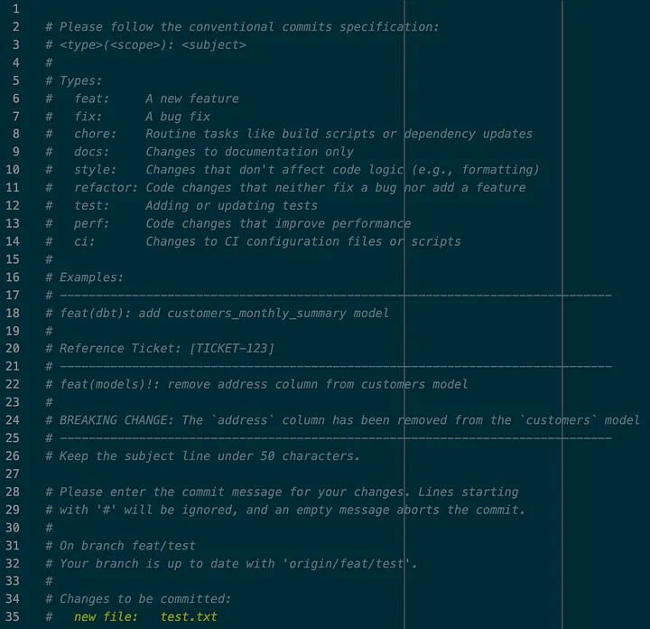

## The motivation behind this series

As an analytics engineer, I've noticed that while most team members understand the fundamentals of Git, they often struggle with more advanced techniques that can drastically improve their workflows. This series of articles aims to close that gap, offering practical solutions to everyday challenges.

## The problem

Enforcing good commit messages is not easy. Too often, people write commit messages like “fix bug” or “update files,” leaving little context for why changes were made or how they affect the project.

But why is this a problem?

When commit messages lack clarity, it’s difficult to understand the history of a project, identify when specific features were added, or debug issues. Inconsistent commit messages can lead to messy git log outputs, making it harder for teams to collaborate efficiently. More importantly, tools like changelog generators and versioning systems rely on structured commit messages to work correctly.

Without clear guidelines, enforcing consistent, meaningful commit messages across a team becomes an uphill battle. Developers need a framework that not only encourages good practices but also helps automate parts of the process. That’s where **Conventional Commits** and **Commit Message Templates** come in.

## The Solution: Conventional Commits + Templates

### Introducing Conventional Commits

The [conventional commits specification](https://www.conventionalcommits.org/en/v1.0.0/) is a standard for writing structured commit messages. It provides a consistent format that developers can follow, which makes understanding the project history much easier. Additionally, it plays a critical role in enabling automated tools to generate changelogs and determine semantic versioning.

A conventional commit message follows this format:

```
<type>(<scope>)<!>: <subject>

<body>

<footer>
```

- **Type**: Indicates the kind of change, such as feat (new feature) or fix (bug fix).
- **Scope** (optional): Specifies the area of the codebase that is affected (e.g., dbt, api).
- **Subject**: A short, descriptive sentence explaining the change.
- **Body**: An optional section for explaining details of the change.
- **Footer**: An optional section for breaking changes, ticket references, and other metadata.
- You can append a ! after the <type>(<scope>) to draw attention to breaking change


For example:

```
feat(models)!: remove address column from customers model

BREAKING CHANGE: The `address` column has been removed from the `customers` model
```

This message clearly communicates that the commit adds a new feature to the authentication module.

Here are the most frequently used commit types in the Angular commit convention:

- **feat**: A new feature.
- **fix**: A bug fix.
- **chore**: Routine tasks like build scripts or dependency updates.
- **docs**: Changes to documentation only.
- **style**: Changes that don’t affect code logic (e.g., formatting).
- **refactor**: Code changes that neither fix a bug nor add a feature.
- **test**: Adding or updating tests.
- **perf**: Code changes that improve performance.
- **ci**: Changes to CI configuration files or scripts.

### Creating a commit message template

Even with the best intentions, it can be hard to remember every detail of the Conventional Commits format, especially during busy workdays. A commit message template helps by providing a pre-defined structure that developers can follow.

#### Step 1: Creating the Template

Let’s start by creating a **.gitmessage.txt** file in your home directory that acts as your commit message template. You can copy paste this one:

```
# Please follow the conventional commits specification:
# <type>(<scope>): <subject>
#
# Types:
#   feat:     A new feature
#   fix:      A bug fix
#   chore:    Routine tasks like build scripts or dependency updates
#   docs:     Changes to documentation only
#   style:    Changes that don't affect code logic (e.g., formatting)
#   refactor: Code changes that neither fix a bug nor add a feature
#   test:     Adding or updating tests
#   perf:     Code changes that improve performance
#   ci:       Changes to CI configuration files or scripts
#
# Examples:
# feat(dbt): add customers_monthly_summary model
#
# Reference Ticket: [TICKET-123]
#
# feat(models)!: remove address column from customers model
#
# BREAKING CHANGE: The `address` column has been removed from the `customers` model
#
# Keep the subject line under 50 characters.
```


This template provides a reminder of the commit types and the expected format, making it easier for developers to write consistent, high-quality commit messages.

Leave a blank line at the beginning of your template file. This way, when Git opens the template, the cursor will start on a new line, saving you from manually adding one before typing your commit message.

#### Step 2: Configuring Git to Use the Template

Now that we have the template, we can configure Git to use it whenever a commit is made. To set the template globally, run the following command:

```
git config --global commit.template ~/.gitmessage.txt
```

#### Step 3: Testing the Commit Message Template

Now that we’ve set up a structured commit message template, let’s test it with a sample commit to see how it helps guide us in writing a well-structured commit message.

- **Make a small change**: Edit a file or make a minor change in your project to prepare for a test commit.
- **Stage your changes**: Use **git add <file_name>** to stage the file for commit.
- **Commit with template**: Run **git commit** without the **-m** option. This will open the template we configured in your default text editor, showing the guidelines for Conventional Commits along with a place to add the commit message.



## Conclusion

A commit message template is a simple yet powerful tool for improving your team's Git hygiene. Combined with Conventional Commits, it enables automation, improves collaboration, and creates a more maintainable project history.

If you haven't configured your default editor yet, check out my previous article for a quick guide.
