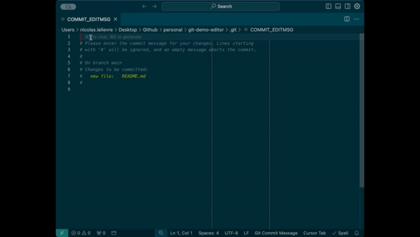

## The motivation behind this series

As an analytics engineer, I've noticed that while most team members understand the fundamentals of Git, they often struggle with more advanced techniques that can drastically improve their workflows. This series of articles aims to close that gap, offering practical solutions to everyday challenges.

## The Problem

I’ve noticed that many analytics engineers continue to use Vim to edit their commit messages, even though they aren’t fully comfortable with it. Often, people bypass the editor altogether by using **git commit -m ""**, opting for single-line commit messages. In most cases, a single-line message is perfectly adequate, but I believe their discomfort with Vim makes them less likely to provide detailed, multi-line messages when needed, as it triggers the Vim console.

## The Solution

Setting your preferred editor is a one-line configuration. Here's how to set VSCode as your default Git editor:

```bash
git config --global core.editor "code --wait"
```

Let's break this down:

- **core.editor**: This Git configuration sets the default editor for commands that require text input, like commit messages.
- **"code --wait"**: This tells Git to open VSCode and *wait* for you to finish editing before proceeding. Without `--wait`, Git would continue immediately after opening the editor.
- **--global**: This ensures the setting applies across all repositories on your machine.

## Testing Your Configuration

To confirm VSCode is set up correctly, try creating a commit without the `-m` flag:

```bash
git add .
git commit
```

Instead of opening Vim in your terminal, VSCode should now open with a commit message template. Write your message (which can be multi-line!), save the file, and close the tab. Git will then complete the commit.



## Troubleshooting

If you encounter this issue:

```
command not found: code
```

VSCode's code` command might not be in your system's PATH. To fix this:

1. Open VSCode
2. Press **Cmd + Shift + P** (macOS) or **Ctrl + Shift + P** (Windows/Linux) to open the command palette
3. Type "Shell Command: Install 'code' command in PATH"
4. Select the option and restart your terminal

## Other Editors

Here are configurations for other popular editors:

### Sublime Text
```bash
git config --global core.editor "subl -n -w"
```

### Atom
```bash
git config --global core.editor "atom --wait"
```

### Nano
```bash
git config --global core.editor "nano"
```

### Vim (if you actually want it)
```bash
git config --global core.editor "vim"
```

### Neovim
```bash
git config --global core.editor "nvim"
```

## Conclusion

Don't let an unfamiliar editor be the reason for poor commit messages. Take 30 seconds to configure Git to use an editor you're comfortable with, and you'll write better commit messages with less friction.
